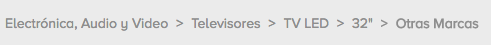
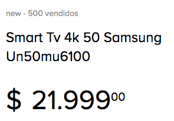
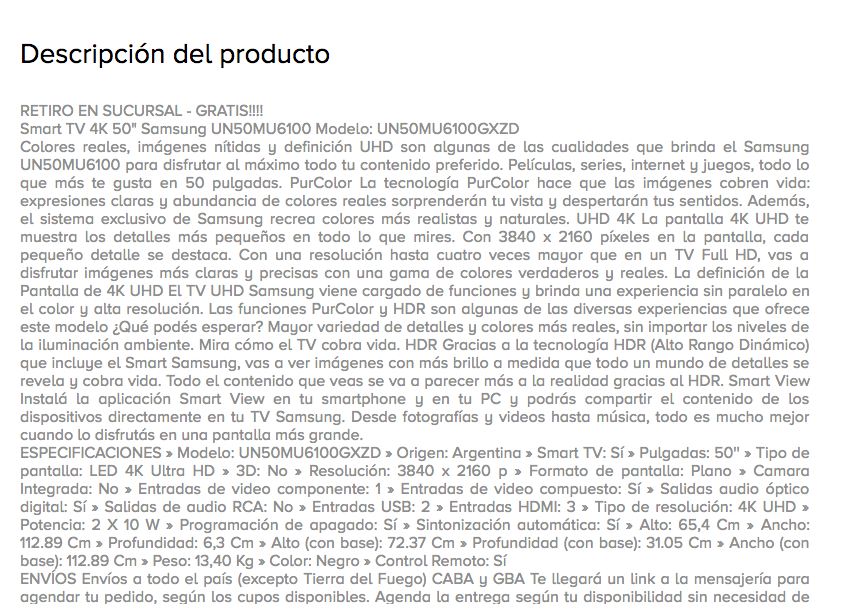

# Mercado Libre Front-End Test

## Requirements

* Mac OS X, Windows, or Linux
* [Node.js](https://nodejs.org/) version 9.0+

## Directory Layout

Before you start, take a moment to see how the project structure looks like:

```
.
├── __tests__             # test file *.spec*
├── configs               # project config files, pm2, webpack, jest
├── src                   # project sources
│   ├── api               # Api middleware => communication between front-end and mercado-libre-api
│   │    ├── components     # schemas, models, controllers, services, endpoints of api-resource
│   │    ├── errors         # errors translations i18n
│   │    └── middlewares    # http status middlewares
│   ├── app               # React Application
│   │    ├── assets         # application resources
│   │    ├── components     # react-componentes
│   │    ├── config         # router, constants and translations
│   │    ├── containers     # react-pages
│   │    ├── flux           # persist layer
│   │    └── helper         # custom functions for react-application
│   ├── core              # nodejs application
│   │    ├── architecture   # nodejs server definition
│   │    ├── helpers        # custom functions for nodejs-application
│   │    ├── logger         # logger definition and configuration
│   │    └── translations   # i18n configuration and handler
│   ├── env               # configs files for all environments
│   └── middlewares       # nodejs server middlewares
└── package.json
```

## Quick start

````bash
git clone git@github.com:DennySegura/mercado-libre-front-end-test.git
cd mercado-libre-front-end-test
npm install
````

## Deploy

### Run server

#### [Release Mode]

````bash
npm run pr # Ejecuta el servidor
npm run start-pr # Ejecuta el servidor + Front
npm run apm-pr # Ejecuta aplicación con PM2
````

#### [Development Mode]

- Para ejecutar de forma independiente el servidor y la aplicación los siguientes comandos en terminales diferentes.

````bash
npm run client-dev
npm run dev
````

- Para ejecutar de forma agrupada.

````bash
npm run start-dev
````

## Front End

### Caja de búsqueda
http://localhost:7000/
### Resultado de búsqueda
http://localhost:7000/items?search=iphone
### Detalle de resultado
http://localhost:7000/items/MLA682627325

# API Reference

## Resource components
Major resource components supported by the API are:

- items

These can be used alone like this

| resource      | description                       |
|:--------------|:----------------------------------|
| `/items`      | return all items                  |

## Parameters

Parameters can be used to query, filter and control the results returned by the API.

| parameter                    | description                 |
|:-----------------------------|:----------------------------|
| `q`                          | query parameter                 |
| `id`                         | relation to filter results by specific id |

## Endpoints

### Lista de productos
http://localhost:7000/api/items?q=tv
### Detalle de producto
http://localhost:7000/api/items/:id

## Tests

````bash
npm run jest
npm run jest-watch
````

## Heath check

Endpoint to health check **http://{HOST}/api/health** this return uptime

## Sample Components
### SearchInput

### AppBar

### BreadCrumb

### Button

### ProductInfo

### ProductDescription


## Developers
* [Denny Segura](https://github.com/dennysegura)
